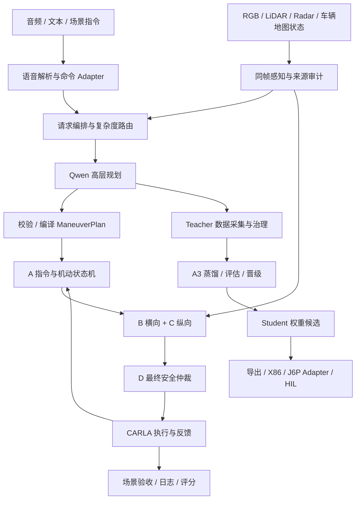

# 全项目架构与功能导航

当前逐入口精读进度见[顺序精读记录](SEQUENTIAL_REVIEW.md)。前述全量静态复核不代表20模块已全部消除占位说明。

范围：原始精读工作树为 `.worktrees/challenge-a1`，起始代码为 `fe1ba839`；发布前已在 2026-09-21 将文档重放到 `team/challenge@155515cf` 并复核源码入口。逐文件“来源 SHA256”统一表示 Git blob 原始字节的 SHA256，不受 Windows/Linux checkout 换行转换影响。`inventory.json` 是 2026-09-20 的静态文件清单；B1–B4、路线/横向控制专题和20模块精读入口现统一收敛到 `docs/architecture/modules/README.md`。
本文档用于继续开发：记录真实执行关系、接口语义、历史兼容原因和改动联动。不把尚未跑过的训练、CARLA、J6P 功能标记为已验收。本轮只整理文档，没有修复业务实现或增加开发门禁。
仓库根工作区及其他 worktree 不在此快照范围内。

## 三层阅读

1. 本页：项目目的、链路和模块总索引。
2. 模块页：模块职责、Interface、上下游和内部功能索引。
3. 功能页：Implementation 入口、字段/单位/时序、异常、验证和联动修改。

不要顺序读上万份数据。按任务进入模块，再用源码索引定位文件/函数；固定数据和实验报告只在验证身份与证据时读取。

## 总体链路

Student 是目标 Planner 替换实现；图中“候选→部署”有未闭合交付环节，见[问题台账](AUDIT.md)。图示职责关系不表示所有路径已经接入正式 runner 或通过硬件 Gate。

## 模块与完整覆盖范围

| 模块页 | 包含目录 / 功能 | 关键交接 |
|---|---|---|
| [运行入口与帧控制](modules/vehicle-entry.md) | runner、ControlRuntime、资源/时钟管理 | 传感器与命令→逐帧控制→执行 |
| [异步规划](modules/vehicle-planner.md) | Router、Orchestrator、模型客户端、校验/编译 | 请求→等待→结果→执行计划 |
| [命令与状态机](modules/vehicle-behavior.md) | A 命令接入、BehaviorFSM、ManeuverFSM | 授权、确认、步骤、终态 |
| [路线与横向控制](modules/vehicle-lateral.md) | B 控制器、route manager/geometry | 路线/姿态→steer |
| [纵向控制](modules/vehicle-longitudinal.md) | C 规划、跟车、PID、停车 | 目标速度/风险→throttle/brake |
| [感知](modules/vehicle-perception.md) | acquisition、检测、追踪、来源审计 | 同帧测量→控制事实 |
| [安全仲裁](modules/vehicle-safety.md) | D、故障/风险覆盖 | raw control→safe control |
| [场景执行与评分](modules/vehicle-scenarios.md) | builder、执行、验收、日志 | 场景合同→事实与结果 |
| [接口与坐标转换](modules/vehicle-interfaces.md) | Schema、类型、compat | 进程内外转换与版本 |
| [Student 结构与预处理](modules/challenge-structure.md) | model、contract、preprocess | ModelRequest→张量→Head |
| [Student Planner](modules/challenge-planner.md) | Backend、Adapter、清单检查 | Head→合法 Plan |
| [Teacher 数据治理](modules/challenge-data.md) | 采集、切分、发布、派生视图 | Teacher 事实→训练数据 |
| [蒸馏与晋级](modules/challenge-training.md) | loss、train、evaluate、checkpoint、Gate | 数据→候选与评估 |
| [导出与部署](modules/challenge-export.md) | ONNX、FLOPs、X86、Horizon | 模型→部署产物 |
| [HIL 与测量](modules/challenge-hil.md) | Runtime Adapter、trace、report | 运行→独立证据 |
| [语音链](modules/support-voice.md) | ASR、复核、NLU | 音频/文本→命令 |
| [Qwen 后端](modules/support-qwen.md) | HTTP、vLLM、协议、health | ModelRequest→模型决策 |
| [配置与场景合同](modules/support-config-scenarios.md) | strategy、policy、scenario JSON | 参数与场景→实际行为 |
| [运行环境与交付](modules/support-delivery.md) | Docker、weights、datasets、submission | 可复现环境与材料 |
| [维护工具](modules/support-tools.md) | tools、scripts | 验证、基准、构建与运维 |

目录被归入三大模块是导航聚合，不改变现有代码所有权或运行时耦合关系。

## 跨模块必读

- [按开发任务定位上下文](MAINTENANCE.md)：从“我要改什么”找到实际功能、联动文件和容易漏掉的验证。
- [Interface 与联动修改矩阵](INTERFACES.md)：哪些定义是权威、谁生产谁消费、改动要查哪里。
- [验证范围与限制](VALIDATION.md)：默认 pytest 的盲区、可执行检查与环境要求。
- [矛盾与重复实现台账](AUDIT.md)：确定问题、待证风险、修复优先级；不凭模块名称判定重复实现可删除。
- [全量源码/入口索引](SOURCE_INDEX.md)：逐文件导航及覆盖计数。
- [覆盖与核对记录](COVERAGE.md)：哪些已逐项登记、哪些经过语义梳理，以及静态记录的限制。
- [机器可读清单](inventory.json)：每个文件的归属，Python 定义/签名、CLI 参数、静态依赖和内容指纹。
- [领域术语](../../CONTEXT.md)：统一 A/B/C/D 与 A1/A2/A3/A4 的含义。

## 文档权威与维护

字段由 Schema / Python 契约定义；实验身份由相应 manifest 定义；当前运行行为由入口及调用代码定义。
功能页解释其联系，不创建第二套可独立演进的接口。历史 README 与报告未全面改写，冲突以台账标注并链接当前导航。

每个模块先给业务语义，再索引功能文档。功能页中“语义说明”用于决策改哪里，“逐文件记录”用于查签名、异常与引用。未从源码证实的原因明确保留为未知，不让 AI 把推测当既定设计。

后续修改完成后，可按实际变化更新对应功能说明、上下游链接及验证记录。本轮清单是静态快照，没有新增自动检查脚本或强制工作流。

## 故障诊断入口

[诊断流程](DIAGNOSIS.md)从失败定位判据与生产者；[追踪矩阵](TRACEABILITY.md)覆盖20模块证据边界。仍保持总览→模块→功能三层。文件覆盖率不等于根因闭合率。

## 20模块接口与参数复核

详见[逐模块复核记录](MODULE_REVIEW.md)：区分源码声明、配置文件值、实际生效参数和运行验收。当前逐文件页358份、语义功能页26份；此前阶段计数不替代本次实际遍历结果。
